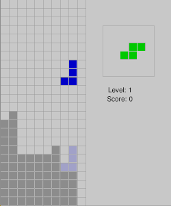

# Tetris
A tetris clone written in C++ using SDL.



## Building the project
```
git clone https://github.com/oskaralund/tetris
cd tetris
cmake .
make
```

## Usage
Move with arrow keys.
* `Up`: Rotate.
* `Down`: Fast drop.
* `space`: Hard drop.
* `R`: Restart.
* `Esc`: Pause.
